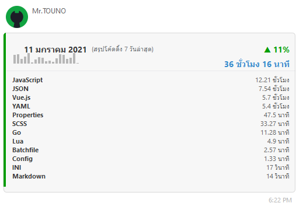
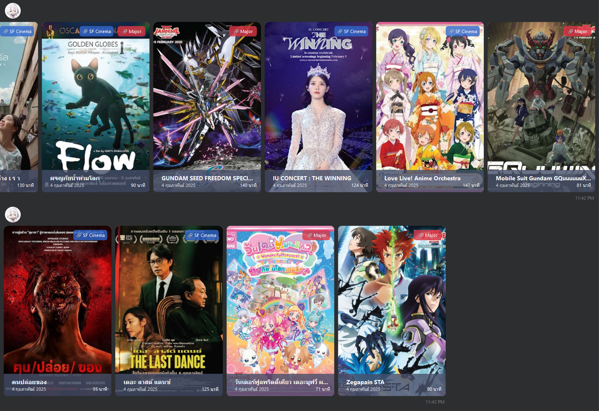

I’m KEM, a senior full-stack engineer. I specialize in translating user-focused designs into pixel-perfect websites.

📝 **Full-Stack Engineer & Open Source Developer**
-------------------
  * 🌍  Based in Bangkok
  * 🖥️  Portfolio: [My Resume](https://dvgamerr.app/)
  * ✉️  Contact: [me@dvgamerr.app](mailto:kananek.dev@dvgamerr.app)
  * 🧠  Currently learning Rust

This is where I open source projects and experiment with new ideas. :rofl:

  * 🔭 Currently working on something cool :wink:
  * 💬 Ask me about Kubernetes, Docker, Nuxt.js, React.js, Deno, Node.js, Golang, Rust
  * 📫 Reach me: [@dvgamerr](https://dvgamerr.app/)

# 📣 Touno™ Project
Started in 2016, this project aims to provide tools and resources for various tasks.

### Web API
-  : Full CV & resume
-  : Wedding card and album

### Tasks
- **Gold-API**: Collects gold price data.
- **Wakatime-API**: Collects wakatime coding status daily.

- **Cinema Web Scraper**: Collects movie screening data from SF and Major cinemas.

## Current Projects
- [gokub-bot](https://github.com/touno-io/gokub-bot): Bitkub Trading Bot
- [go-bitkub](https://github.com/touno-io/bitkub-go): Bitkub API and WebSocket for Golang

### Skills

### Socials

---

  

    <h3>Wakatime Language (code activity last 7 days)</h3>
    
  

  

    <h3>GitHub Stats</h3>
    
  

---

### License
MIT © 2023 Touno™
