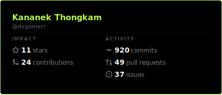
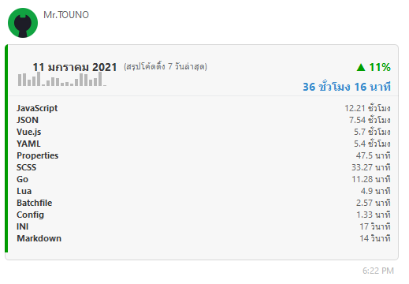
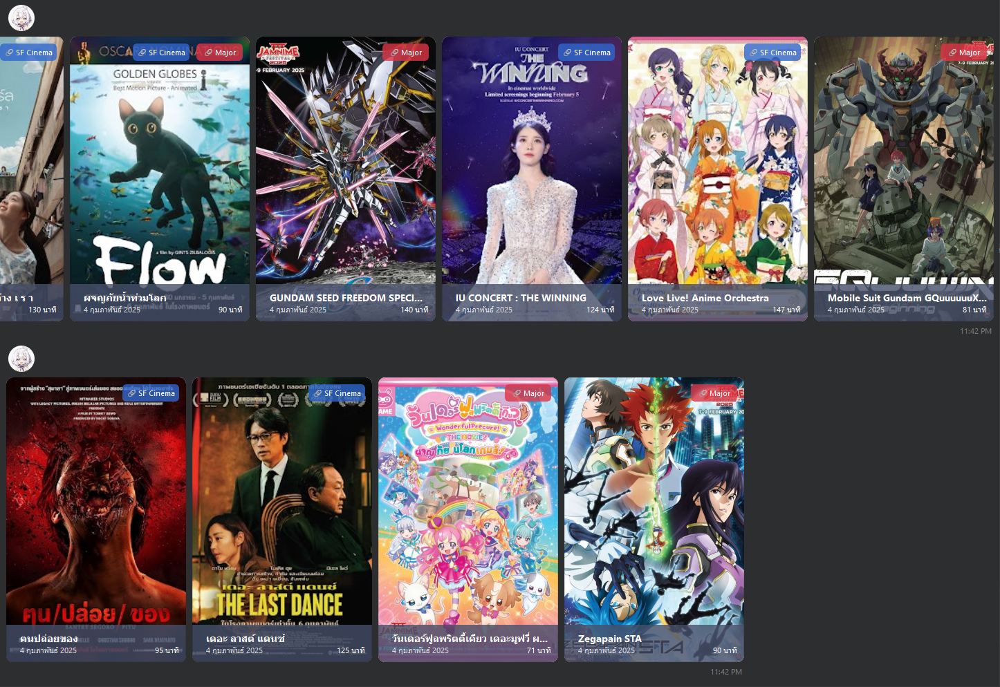

# 👋 Hi, I’m KEM — Full‑Stack DevOps & AI Engineer
I’m a senior engineer based in Bangkok, crafting seamless user experiences and building robust, scalable backend systems. From pixel‑perfect frontends to Kubernetes‑powered infrastructures, CI/CD pipelines, and AI‑driven solutions — I deliver end‑to‑end engineering excellence.

---

## 🔧 About Me

- 🌍 Based in Bangkok  
- 🖥️ [Portfolio / Resume](https://dvgamerr.app/)  
- ✉️ [me@dvgamerr.app](mailto:kananek.dev@dvgamerr.app)  
- 🧠 Currently learning **Rust**

### 🚀 Tech Stack & Interests

> Ask me about:

- Kubernetes • Docker • CI/CD  
- Nuxt.js • React.js • Deno • Node.js  
- Golang • Rust • Full-Stack Engineering  
- AI tools, data pipelines, and open source tooling

---

## 📣 Touno™ Project

Started in 2016 — building tools and ideas that make life easier (or at least more fun 😎).

### 🧠 Core Projects

- 🔁 [**gokub-mcp**](https://github.com/dvgamerr-app/gokub-mcp) – Bitkub MCP for AI
- 🔌 [**go-bitkub**](https://github.com/dvgamerr-app/go-bitkub) – Golang API + WebSocket SDK for Bitkub

### ✨ Fun Side Projects

-  – My personal site (more updated than my todo list)
-  – Built a wedding site just to avoid planning the actual wedding 🎉

### 🖥 My Machines & Dev Servers

> Keeping things running with style, silence, and power ⚡

| Name            | Type                       | Status |
|-----------------|----------------------------|--------|
| **AORUS PC**     | 🎮 Dev/Gaming Rig            |  |
| **Mac mini M4**  | 🍎 HomeLab & K8s Web Server     |  |
| **BeeSynology**  | 🐝 NAS             |  |

---

### 🎮 Useless (but cool) Things I Made Instead of Working

- **Gold-API** – Because manual price-checking is for peasants  
- **Wakatime-API** – Tracks how long I procrastinate with code  
- **Popcorn AI** – Movie snack recommendations. Yep, that exists  
- **Cinema Web Scraper** – Because picking a showtime shouldn't take 10 clicks

  
    
  

---

## 📊 Weekly Code Activity

---

## 📄 License

MIT © 2023 Touno™
